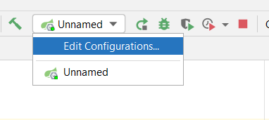
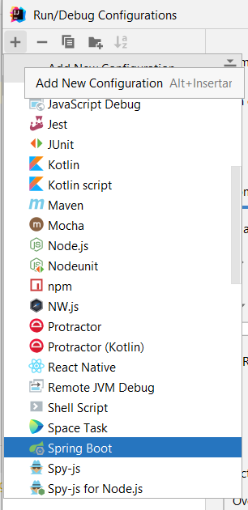
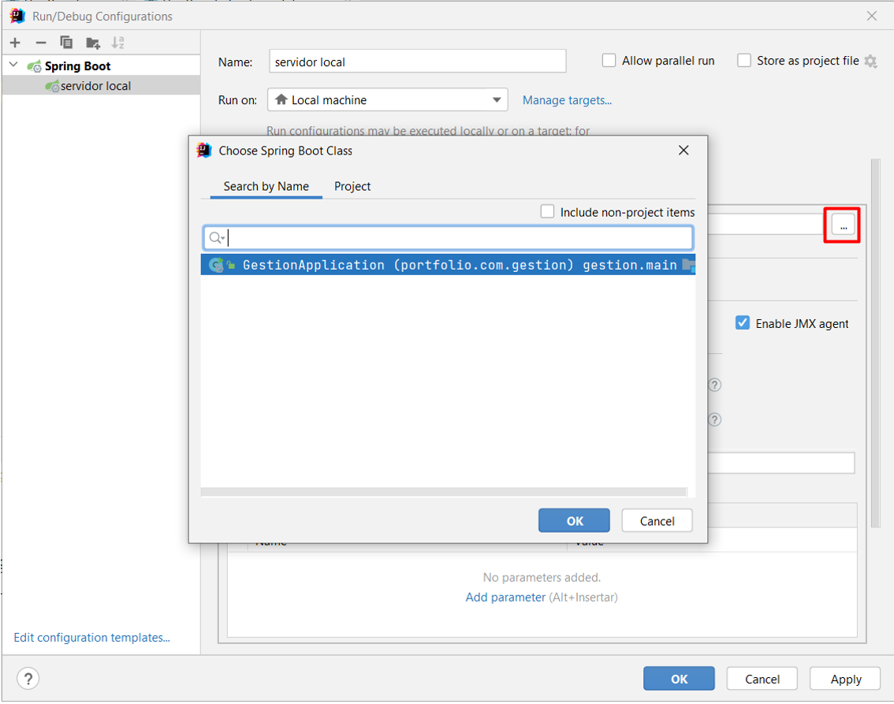
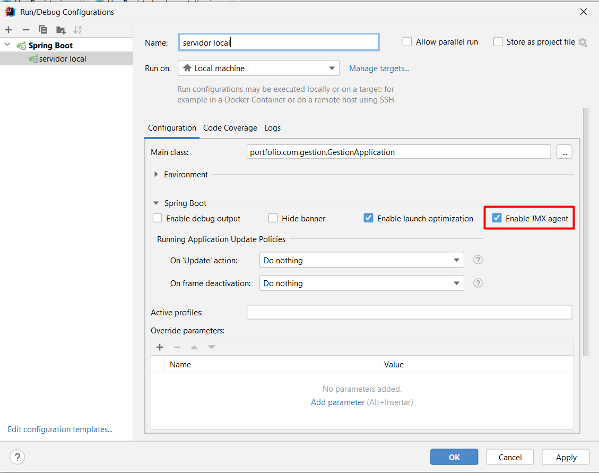
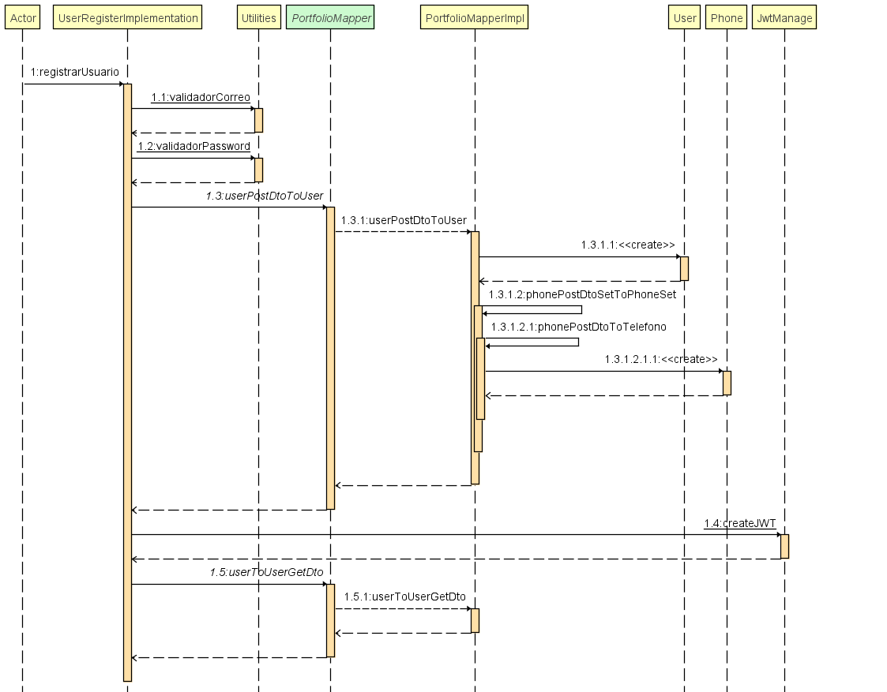
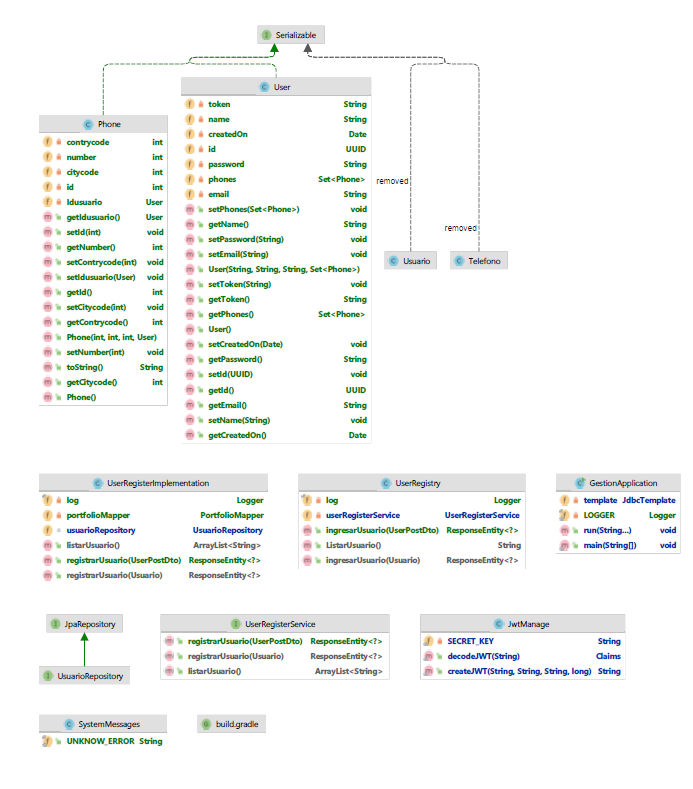
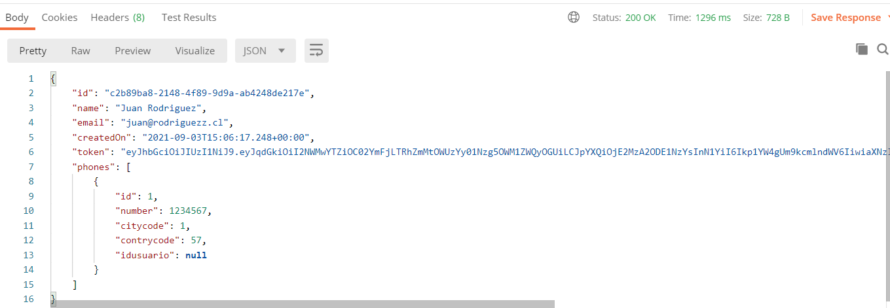
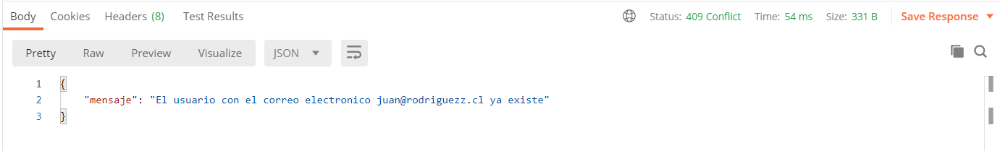
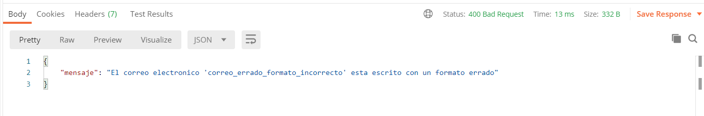
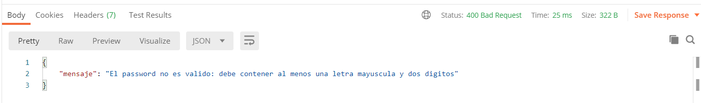

# UserRegister
Registro de usuarios a traves de un endpoint post

### **Comenzando 🚀**

Estas instrucciones te permitirán obtener una copia del proyecto en funcionamiento en tu máquina local para propósitos de desarrollo y pruebas.

Pre-requisitos 📋

Se requiere Java 8 instalado en el equipo para levantar el proyecto y Postman para realizar las solicitudes http.

### **Instalación 🔧**

Se debe descargar el proyecto o descargarlo desde el repositorio en la IDE a utilizar. Una vez descargado debe levantarse el servidor para ejecutar aplicaciones bajo Spring boot. Ejemplo anexo, la configuracion en IntellyJ:

Paso 1: editar configuracion de ejecucion/debug

Paso 2: Seleccionar "agregar nueva configuracion" (+) y escoger Spring Boot

Paso 3: Hacer click sobre el boton de busqueda (enmarcado en el cuadro rojo en la imagen) y seleccionar la ruta de la clase contenedora del metodo principal

Paso 4: Asegurarse de que haya sido seleccionada la opcion "Enable JMX agent"

Finalmente, puede hacerse click sobre el boton ejecutar o debugg para iniciar o ejecutar en modo debug el proyecto.

### **Construido con 🛠️**

Para la construccion del proyecto se utilizo:

* Java 8: como lenguaje de programacion, basado en el framework Spring Boot
* Gradle: para la construccion del proyecto y sus dependencias
* H2: motor de base de datos integrado de Spring Boot usado para el ambiente de desarrollo
* Postman: para la invocacion de los servicios

Diagrama de secuencia del proyecto:

Componentes y clases del proyecto:

### **Ejecucion ⚙**

Este proyecto consta de un endpoint para el registro de usuarios, cuyos datos deben ser proporcionados mediante un Json con los siguientes datos:

  * Nombre del usuario
  * Correo Electronico
  * Password
  * Telefonos️

Todas las respuestas son retornadas en formato Json por el endpoint "/usuario/ingresar".
Para probar el servicio, se sugiere descargar la [coleccion](documentation/collections/Gestion.postman_collection.json) o buscarlo en la ruta de este mismo proyecto: "gestion/documentation/collections/Gestion.postman_collection.json". Una vez obtenido el archivo, simplemente importarlo en Postman.
Como resultado; puede obtener uno de los siguientes valores:

Caso 1- insercion exitosa. Codigo de respuesta: 200
Se registro exitosamente el usuario en la base de datos. Se recibe un Json indicando los datos del usuario, el id de registro, la fecha/hora de insercion en la tabla Usuarios, y el token generado para poder acceder al sistema.

Ejemplo: 

Caso 2 - Insercion fallida. Codigo de respuesta: 409
Se intento ingresar un usuario con un correo electronico preexistente en la base de datos. 

Ejemplo:

Caso 3: Error en formato de correo electronico. Codigo de respuesta: 400 
Se ingreso un correo electronico que no cumple el formato nombre@dominio.cl y se devuelve el mensaje de error indicando que se envio como correo electronico.

Ejemplo:

Caso 4: Error en formato de password. Codigo de respuesta: 400
Se ingreso un password que no cumple las condiciones minimas establecidas: una mayuscula, al menos dos numeros.

Ejemplo:

A nivel de logs los mismos son generados en la consola, indicando entre corchetes el metodo desde donde esta siendo generado. Se registra la misma respuesta que se ve por la salida del servicio.

Ejemplo:

[registrarUsuario] {"mensaje": "El usuario con el correo electronico juan@rodriguezz.cl ya existe"}

### **Autores ✒**️

 * **Ruben Caicedo** - _Desarrollo y documentacion_